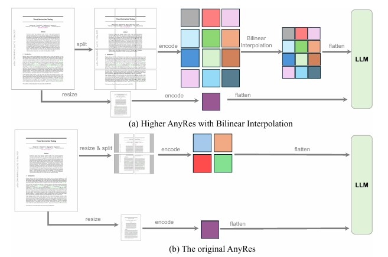

# Multimodal Instruction Tuning

今天阅读的论文模块是[**Multimodal Instruction Tuning**](https://github.com/BradyFU/Awesome-Multimodal-Large-Language-Models?tab=readme-ov-file#multimodal-instruction-tuning)，作为对齐训练的下一步，指令微调可以帮助模型理解用户的具体需求，更准确地执行任务，并能够提高在新任务上的零样本推理能力，是大模型训练中至关重要的一步。下面来剖析3篇文章，加深对多模态大模型（MLLM）理解。

## Table of Contents
- [**Paper Reading**](#Paper-Reading)
  - [**Visual Instruction Tuning**](#visual-instruction-tuning)
  - [**LLaVA-OneVision: Easy Visual Task Transfer**](#llava-oneVision)
  - [**Qwen2-VL: Enhancing Vision-Language Model's Perception of the World at Any Resolution**](#qwen2-vl)
- [**Coding**](#Coding)
  - [**llava源码分析之-prepare_inputs_labels_for_multimodal**](#llava源码分析之-prepare-inputs-labels-for-multimodal)


### Paper Reading

#### <a id="visual-instruction-tuning"></a>[**Visual Instruction Tuning**](https://arxiv.org/pdf/2304.08485)

​		这篇文章是多模态大模型指令微调的经典之作，提出了一个通过纯语言GPT-4生成的多模态语言图像指令遵循数据，使用COCO图像生成三种类型的图像-语言指令跟随数据，具体为58000个对话样本，23000个详细描述，77000个复杂推理样本。

​		在[**llava-Instruct-150k**](https://huggingface.co/datasets/liuhaotian/LLaVA-Instruct-150K)指令跟随数据的基础上，作者采用“视觉编码器-线性层-大语言模型（LLM）”的架构，训练了一个多模态大模型llava，这个架构也被沿用至今。在llava中，视觉编码器选择CLIP的[**VIT-L/14**](https://huggingface.co/openai/clip-vit-large-patch14)，大语言模型选择[**Vicuna**](https://huggingface.co/lmsys/vicuna-7b-v1.5)，线性层的作用是把图像编码投影为LLM可以理解的token，当然，投影层也可以选择OpenFlamingo的门控交叉注意力或者BLIP-2的Q-former，不过这些模态对齐方法更复杂，作者在这里考虑到希望投影层是轻量级，能够快速迭代数据。在**[To Preserve or To Compress: An In-Depth Study of Connector Selection in Multimodal Large Language Models](https://arxiv.org/pdf/2410.06765)**一文中，作者研究了不同投影层类型的影响，Q-former并没有展现更好的性能，简单的双层MLP和平均池化就可以展现不错的性能，另外，图像分辨率对MLLM的性能有较大的影响，这说明图像编码器的选择是非常重要的。

​		llava采用的是两阶段训练，第一阶段为特征对齐训练，冻结图像编码与LLM，训练投影层以对齐图像和文本特征，第二阶段为指令微调，只冻结图像编码器，微调投影层和LLM以增强模型的任务泛化能力。llava在对话、详细描述、复杂推理任务都远远超过[**OpenFlamingo**](https://arxiv.org/pdf/2308.01390)和[**BLIP-2**](https://arxiv.org/pdf/2301.12597)，达到了SOTA，在ScienceQA任务上则接近SOTA。

​	llava已被迅速应用到其他领域，如[**video-llava**](https://arxiv.org/pdf/2311.10122)、[**llava-med**](https://arxiv.org/pdf/2306.00890)，如今已是最常用的多模态大模型架构。


#### <a id="llava-oneVision"></a>[**LLaVA-OneVision: Easy Visual Task Transfer**](https://arxiv.org/pdf/2408.03326)

​		llava-onevision是一个开放式的多模态大模型，能够处理单图像、多图像和视频场景下的视觉任务。llava-onevision沿用llava的设计，视觉编码器采用SigLIP，LLM采用Qwen-2，投影层选择两层MLP。另外，作者还提出了一个新的AnyRes策略，灵活处理图像和视频的token，如下图。



​		图（a）中，下面的分支表示基础图像，即将高分辨率图像resize到适应图像编码器的固定分辨率，上面的分支表示将高分辨率图像进行裁剪，若裁剪后的区域分辨率较高，则会考虑使用双线性插值减少token数目。下图是AnyRes策略在单图像、多图像、视频场景下的token计算示例图。


​		对于单图像，AnyRes考虑了基础图像和裁剪区域的大量token，对于多图像，AnyRes只考虑基础图像token，对于视频，每个帧都会调整为基础图像分辨率，使用双线性插值减少token数目，允许在减少每帧token的同时考虑更多的帧。在这样的策略下，llava-onevision较好地平衡了性能和计算成本。

​		值得注意的是，在第一阶段的对齐训练和第二阶段的指令微调中，作者还插入了一个1.5阶段，整理了一个包括**重新描述的详细描述**、**文档/OCR**、**中文和语言**的高质量数据作为该阶段训练集。在第一阶段中，只使用单图像与基础图像图像分辨率，1.5阶段则使用单图像与扩展分辨率，第二阶段的指令微调分为两步，第一步使用单图像与扩展分辨率，第二步使用单图像、多图像、视频混合数据集与扩展分辨率，让MLLM慢慢过渡到开放场景。第一阶段只更新投影器，而后续阶段更新整个模型。

​		作者在大量单图像、多图像、视频场景基准都做了测试，不过在很多基准上，性能都落后于同一月份的Qwen2-VL工作。


#### <a id="qwen2-vl"></a>[**Qwen2-VL: Enhancing Vision-Language Model's Perception of the World at Any Resolution**](https://arxiv.org/pdf/2409.12191)****

​		Qwen2-VL是对Qwen-VL等一系列MLLM的改进，过去大多数MLLMs都是处理固定分辨率的图像，Qwen2-VL引入一个**“Native Resolution Input”**机制，可以处理任何分辨率的图像。**“Native Resolution Input”**动态地将图像转化为可变数据的视觉token，从下面的Qwen2-VL框架图来看，**“Native Resolution Input”**主要是将图像和视频压缩为一定数据的token，然后嵌入到LLM中，对于图像压缩4倍，对于视频压缩8倍，不超过LLM所能接受的token数量。由于进行了压缩，VIT中的绝对位置编码不能用了，作者改为二维旋转位置编码（2D-RoPE）来捕获图像的二维位置信息。另外，在每个图像或者视频前后加入`<|vision_start|>`和`<|vision_end|>`特殊标记，这就构成了一个完整的视觉编码。


​		原始的RoPE只能编码一维位置信息，作者对其进行了拓展，提出了M-RoPE，将原始RoPE分解为三个维度来实现：time、heigh、width，即共同由`$$(ID_{time}, ID_{heigh}, ID_{width})$$`决定位置信息。对于文本，这些维度都使用相同的位置ID，对于图像，时间ID保持不变，对于视频，每个维度ID具体分配，如下图所示。


​		Qwen2-VL在DocVQA、InfoVQA、RealWorldQA、MTVQA等多个视觉基准达到了SOTA。Qwen2-VL-72B在各种agent基准测试中与GPT-4o的性能相当。Qwen2-VL能够理解超过20分钟长度的视频，并在多语言、OCR、数据推理都取得了领先的水平。

​		由于是同一时期的工作，Qwen2-VL和llava-onevision没有相互比较，Qwen2-VL没有在多图像场景下进行测试，不过在单图像和视频基准上，Qwen2-VL都领先llava-onevision不少。


### Coding

#### <a id="llava源码分析之-prepare-inputs-labels-for-multimodal"></a>[**llava源码分析之-prepare_inputs_labels_for_multimodal**](https://github.com/haotian-liu/LLaVA/blob/c121f0432da27facab705978f83c4ada465e46fd/llava/model/llava_arch.py#L145)

​		`prepare_inputs_labels_for_multimodal`函数llava处理模态对齐的核心，下面主要关注图像和文本编码是如何拼接的。

首先，将文本的token按照`cur_input_ids == IMAGE_TOKEN_INDEX`条件进行判断得到`IMAGE_TOKEN`的位置，并用`image_token_indices`记录，再循环遍历得到`cur_input_ids_noim`，并从`self.get_model().embed_tokens`中提取token编码得到`cur_input_embeds_no_im`，表示没有`IMAGE_TOKEN`的文本编码。

```python
image_token_indices = [-1] + torch.where(cur_input_ids == IMAGE_TOKEN_INDEX)[0].tolist() + [cur_input_ids.shape[0]]
cur_input_ids_noim = []
cur_labels = labels[batch_idx]
cur_labels_noim = []
for i in range(len(image_token_indices) - 1):
    cur_input_ids_noim.append(cur_input_ids[image_token_indices[i]+1:image_token_indices[i+1]])
    cur_labels_noim.append(cur_labels[image_token_indices[i]+1:image_token_indices[i+1]])
split_sizes = [x.shape[0] for x in cur_labels_noim]
cur_input_embeds = self.get_model().embed_tokens(torch.cat(cur_input_ids_noim))
cur_input_embeds_no_im = torch.split(cur_input_embeds, split_sizes, dim=0)
```

接着，将`cur_input_embeds_no_im`与`cur_image_features`进行拼接，得到`cur_new_input_embeds`，就得到一个样本图像与文本拼接的编码。`cur_labels`的处理和`cur_input_ids`处理类似。

```python
cur_new_input_embeds = []
cur_new_labels = []

for i in range(num_images + 1):
	cur_new_input_embeds.append(cur_input_embeds_no_im[i])
	cur_new_labels.append(cur_labels_noim[i])
	if i < num_images:
		cur_image_features = image_features[cur_image_idx]
		cur_image_idx += 1
		cur_new_input_embeds.append(cur_image_features)
		cur_new_labels.append(torch.full((cur_image_features.shape[0],), IGNORE_INDEX, device=cur_labels.device, dtype=cur_labels.dtype))

cur_new_input_embeds = [x.to(self.device) for x in cur_new_input_embeds]

cur_new_input_embeds = torch.cat(cur_new_input_embeds)
cur_new_labels = torch.cat(cur_new_labels)
```

最后，将`cur_new_embed`、`cur_new_labels`、`attention_mask`、`position_ids`填充到指定的最大长度。

```python
new_input_embeds_padded = []
new_labels_padded = torch.full((batch_size, max_len), IGNORE_INDEX, dtype=new_labels[0].dtype, device=new_labels[0].device)
attention_mask = torch.zeros((batch_size, max_len), dtype=attention_mask.dtype, device=attention_mask.device)
position_ids = torch.zeros((batch_size, max_len), dtype=position_ids.dtype, device=position_ids.device)
        
for i, (cur_new_embed, cur_new_labels) in enumerate(zip(new_input_embeds, new_labels)):
    cur_len = cur_new_embed.shape[0]
    if getattr(self.config, 'tokenizer_padding_side', 'right') == "left":
        new_input_embeds_padded.append(torch.cat((
            torch.zeros((max_len - cur_len, cur_new_embed.shape[1]), dtype=cur_new_embed.dtype, device=cur_new_embed.device),
            cur_new_embed
        ), dim=0))
        if cur_len > 0:
            new_labels_padded[i, -cur_len:] = cur_new_labels
            attention_mask[i, -cur_len:] = True
            position_ids[i, -cur_len:] = torch.arange(0, cur_len, dtype=position_ids.dtype, device=position_ids.device)
        else:
            new_input_embeds_padded.append(torch.cat((
                cur_new_embed,
                torch.zeros((max_len - cur_len, cur_new_embed.shape[1]), dtype=cur_new_embed.dtype, device=cur_new_embed.device)
            ), dim=0))
            if cur_len > 0:
                new_labels_padded[i, :cur_len] = cur_new_labels
                attention_mask[i, :cur_len] = True
                position_ids[i, :cur_len] = torch.arange(0, cur_len, dtype=position_ids.dtype, device=position_ids.device)

                new_input_embeds = torch.stack(new_input_embeds_padded, dim=0)
```


