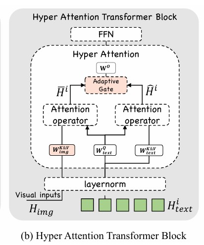
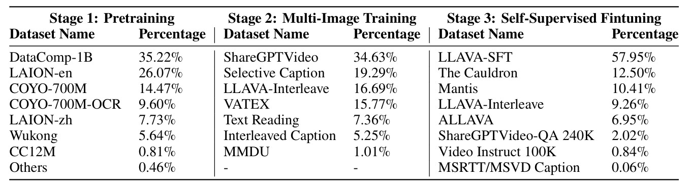
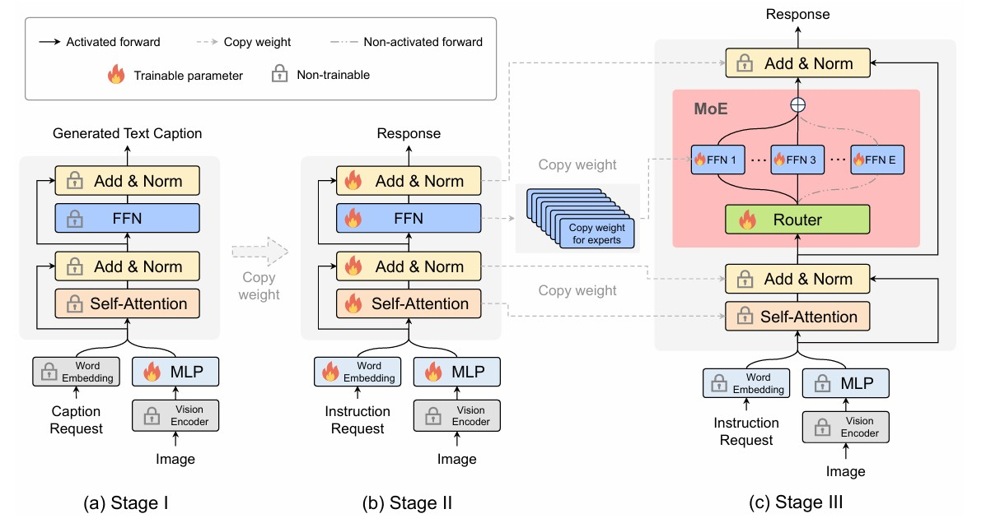
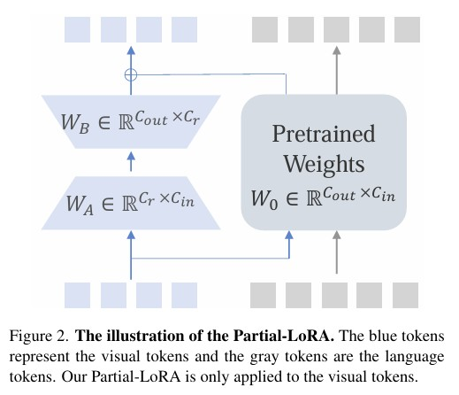

# Multimodal Instruction Tuning

今天继续阅读论文模块[**Multimodal Instruction Tuning**](https://github.com/BradyFU/Awesome-Multimodal-Large-Language-Models?tab=readme-ov-file#multimodal-instruction-tuning)

## Table of Contents

- [**Paper Reading**](#Paper-Reading)
  - [**mPLUG-Owl3: Towards Long Image-Sequence Understanding in Multi-Modal Large Language Models**](#mplug-owl3)
  - [**MoE-LLaVA: Mixture of Experts for Large Vision-Language Models**](#moe-llava)
  - [**InternLM-XComposer2: Mastering Free-form Text-Image Composition and Comprehension in Vision-Language Large Model**](#internLM-xcomposer2)

### Paper Reading

#### [**mPLUG-Owl3: Towards Long Image-Sequence Understanding in Multi-Modal Large Language Models**](https://www.arxiv.org/pdf/2408.04840)

- 主要贡献：
  - mPLUG-Owl3增强了对长图像序列的理解能力，并在包含检索到的图像-文本知识、交错的图像-文本和长视频场景中表现出色。
- 解决的问题：
  - 以往的MLLM在处理长图像序列时存在效率和性能的挑战。
- 创新点：
  - Hyper Attention模块：提出Hyper Attention模块来有效地将视觉和语言整合到一个共同的语言引导的语义空间，从而扩展到多图像场景。
  - 多模态交错旋转位置编码（MI-Rope）：MI-Rope在交错的图像-文本输入中正确理解图像的原始位置。

与llava不同的是，mPLUG-Owl3采用了“**视觉编码器-交叉注意力-LLM**”的MLLM架构，作者认为将视觉特征通过线性投影层，然后嵌入到文本序列中，会耗尽LLM的token，阻碍MLLMs对长视觉输入的建模，且可能会在通过LLM时，丢失视觉细节。因此，作者使用交叉注意力连接视觉特征和文本特征，但与Flamingo、EVLM设计的交叉注意力不同，后者在每层使用交叉注意力会引入大量的额外参数，开销大且没有考虑交错序列中图像的原始位置，因此无法适应到多图像场景。作者设计了一个轻量级的Hyper Attention模块，稀疏插入到LLM中（例如Qwen2中的[0, 9, 17, 25]层），以更少的参数量达到更好的性能，并设计了一个多模态交错旋转位置编码（MI-Rope）来维护图像的位置信息。

   

- **Hyper Attention模块（如上图）：**

  - **共享LayerNorm层：**作者发现视觉特征和文本特征都采用LLM中transformer block中的LayerNorm层能更好地收敛，原因是让LayerNorm的输出均值和方差兼容到LLM的分布特征。
  - **特定模态的Key-Value：**在交叉注意力中，Query来自于文本，Key和Value来自于视觉。作者使用LLM自注意力的Query与视觉的Key&Value做交叉注意力，再与LLM的自注意力，通过一个Adaptive Gate进行融合。在这里，视觉的Key&Value是用LLM的Key&Value作初始化的。
  - **Adaptive Gating：**设置一个可学习参数g，公式如下。

  $$
  \begin{aligned}
  \mathbf{g} & =\operatorname{Sigmoid}\left(\mathbf{W}_{\text {gate }}^T \hat{\mathbf{H}}^{\mathrm{i}}\right) \\
  \mathbf{H}_{\text {fused }}^{\mathrm{i}} & =\overline{\mathbf{H}}_{\text {text }}^{\mathrm{i}} * \mathrm{~g}+\hat{\mathbf{H}}_{\text {text }}^{\mathrm{i}} *(1-\mathbf{g})
  \end{aligned}
  $$

- **MI-Rope：**记录图像在文本中的绝对位置，并用这个位置计算RoPE。同个图像的每个patch使用一样的位置。

mPLUG-Owl3的训练阶段分为预训练（使用单图像），多图像训练，自监督微调（指令微调），如下。

   

mPLUG-Owl3在14个基准测试中的20个中取得了最佳性能，包括视觉问答，MLLM基准、视频、多图像场景。另外，作者提出了一个“**Distractor Resistance**”的数据集，用于评估模型在长视觉上下文中抵抗干扰的能力。

#### [**MoE-LLaVA: Mixture of Experts for Large Vision-Language Models**](https://arxiv.org/pdf/2401.15947.pdf)

- **主要贡献：**提出了一个简单有效的MoE-Tuning策略，用于MLLM，在大约3B个稀疏激活参数，MoE-LLaVA在各种视觉理解数据集上展现出与LLaVA-1.5-7B相当的性能，甚至在对象幻觉基准测试中超过了LLaVA-1.5-13B。
- **解决问题：**现在的MLLM在每个token计算过程中需要激活所有模型参数，导致了巨大的训练和推理成本。
- **创新点：**MoE-Tuning策略包括三个阶段，分别针对不同的训练目标和数据集，使MLLM平滑过渡到稀疏的专家混合模型。

   

MoE-Tuning的框架如上图，思路比较简单。第一阶段为模态对齐训练，只训练MLP，第二阶段指令微调MLP、和LLM，第三阶段将第二阶段的FFN复杂多份作为多专家的初始化权重，训练时激活top-k个专家。

另外，除了MLLM的自回归损失，作者还加入了一个负载均衡损失，避免在MoE的训练中，各个专家能够均衡地得到训练，公式如下：
$$
L_{\mathrm{aux}}=E \cdot \sum_{i=1}^E F_i \cdot G_i,
$$
其中*F* 表示每个专家处理的token的比例，*G*表示的平均路由概率，可以通过以下公式表示：
$$
\begin{aligned}
& F=\frac{1}{K} \sum_{i=1}^K 1\{\operatorname{argmax} P(x)=i\}, \\
& G=\frac{1}{K} \sum_{i=1}^K P(x)_i .
\end{aligned}
$$
MoE-LLaVA在POPE对象幻觉基准测试中以2.2B激活参数超过了LLaVA-1.5-13B，显示出较大的性能优势。MoE-LLaVA在只有2.2B稀疏激活参数的情况下，其性能与拥有大约8倍激活参数的InternVL-Chat-19B相当。当MoE-LLaVA扩展到3.6B稀疏激活参数时，其在ScienceQA、POPE、MMBench、LLaVAW和MM-Vet等基准测试中的性能分别超过了LLaVA-1.5-7B的1.9%、0.4%、0.9%、30.7%和3.8%。

#### [**InternLM-XComposer2: Mastering Free-form Text-Image Composition and Comprehension in Vision-Language Large Model**](https://arxiv.org/pdf/2401.16420.pdf)

- **主要贡献：**InternLM-XComposer2能够处理自由形式的输入，如详细说明、结构化大纲和参考图像，并生成高质量的、集成的交错文本-图像文章。
- **解决的问题：**传统的MLLMs在理解和生成交错文本-图像内容方面存在限制。
- **创新点：** 提出了一种新的方法，即部分低秩适应（Partial LoRA），它通过仅对图像标记应用额外的LoRA参数来实现模态对齐，以保持预训练语言知识的完整性，同时在精确的视觉理解和文学才能的文本组合之间取得平衡。

   

当前的模态对齐方法主要采用两种方法之一：要么将视觉标记和语言标记平等对待，要么将它们视为完全不同的实体。第一种方法忽视了模态之间的固有属性差异，而第二种方法导致了巨大的对齐成本。这篇文章的重点是提出了Partial LoRA，如上图，用于对齐视觉和文本。Partial LoRA应用于所有视觉token。公式如下，将低秩矩阵、原参数矩阵与视觉相乘再相加，再与文本特征拼接，没想到简单的设计就有较好的效果。
$$
\begin{aligned}
& \hat{x}_t=W_0 x_t+B_0 \\
& \hat{x}_v=W_0 x_v+W_B W_A x_v+B_0 \\
& \hat{x}=\left[\hat{x}_v, \hat{x}_t\right]
\end{aligned}
$$
作者采用了CLIP ViT-L-14-336作为视觉编码器，InternLM-2作为文本编码器。Partial LoRA中的秩为256。

